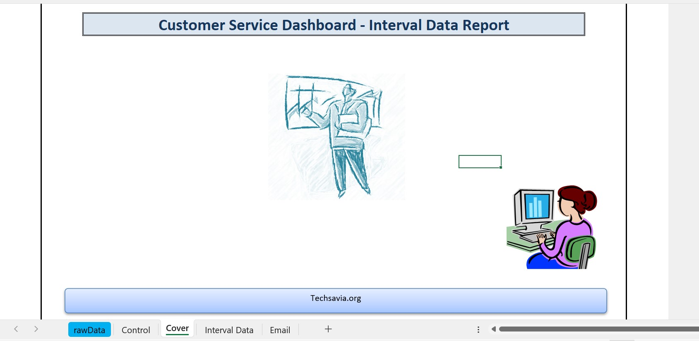
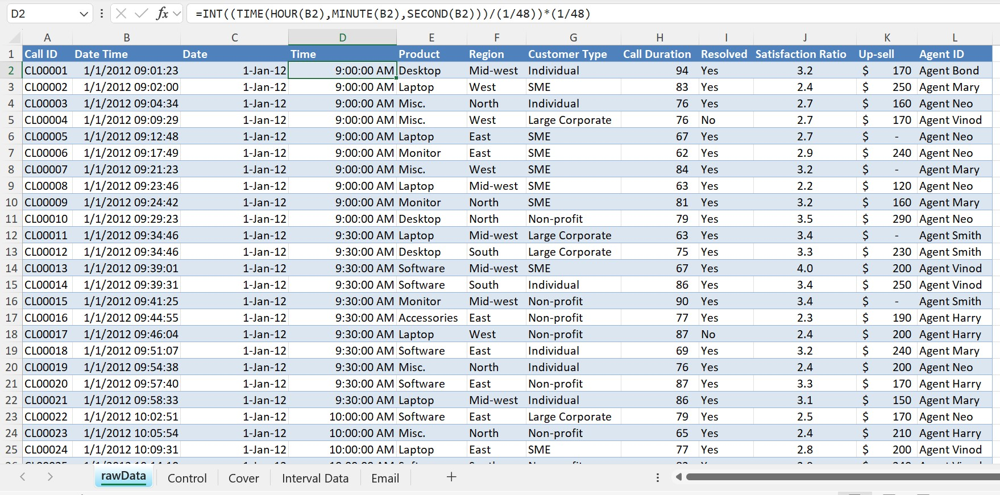
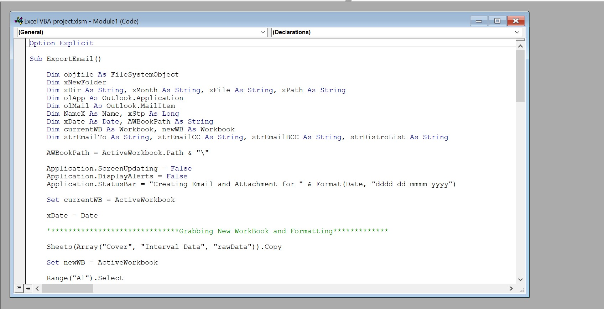
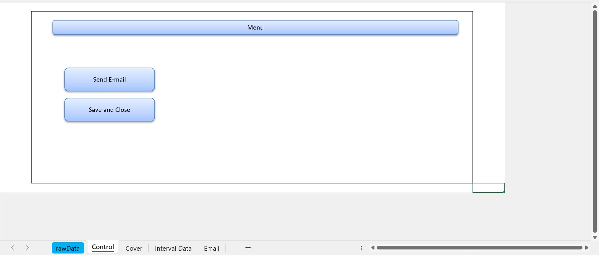
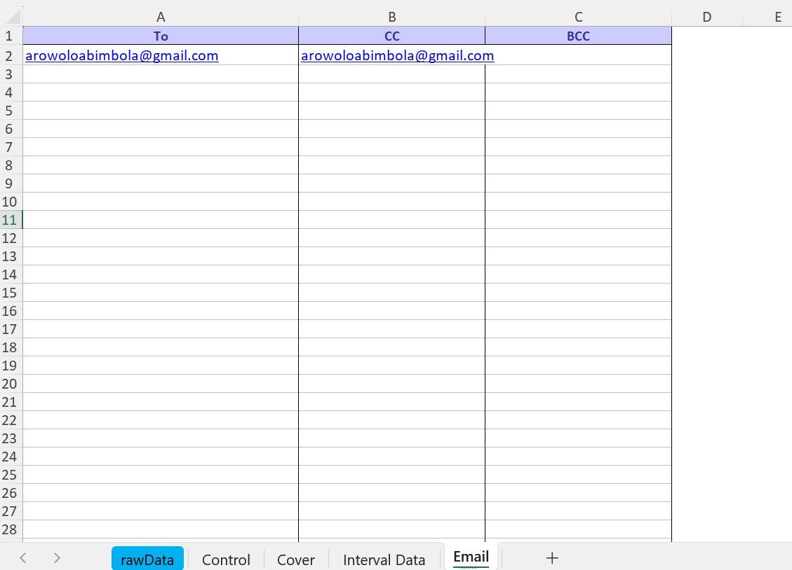
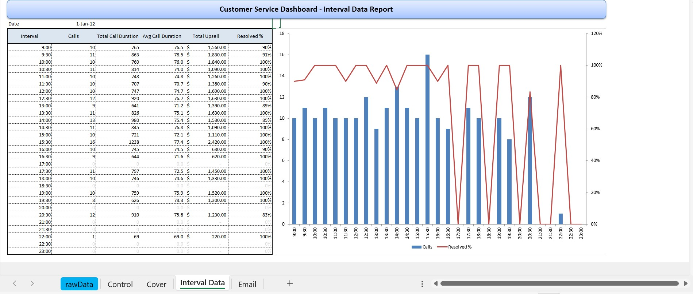

# Automated Email Reporting with Excel VBA & Outlook

> **Excel Automation Project** | Tools: Microsoft Excel, VBA, Microsoft Outlook
**Domain:** Business Process Automation · Reporting · Data Aggregation  
**Type:** End-to-End Automation Project



##  The Problem

Customer service teams rely on regular performance reports - but in many organizations, **generating and distributing those reports is done manually**. An analyst exports data, formats a dashboard, saves the file, opens Outlook, attaches the file, types recipient names, and hits send. Every. Single. Time.

This process is:
- **Time-consuming** - up to 30 minutes per report cycle
- **Error-prone** - wrong recipients, outdated files, forgotten attachments
- **Unscalable** - as teams grow, manual distribution breaks down


## The Solution

This project automates the full reporting pipeline using **Excel VBA integrated with Microsoft Outlook**. With a single button click, the system:

1. Pulls and processes raw call center data
2. Calculates performance metrics by 30-minute intervals
3. Generates a clean, formatted report workbook
4. Saves it to the correct monthly folder (auto-created if missing)
5. Emails it to the right stakeholders - TO, CC, and BCC — automatically

**What used to take 30 minutes of manual work now takes under 10 seconds.**


## Business Impact

| Before Automation | After Automation |
|---|---|
| ~30 mins manual effort per report | < 10 seconds per report cycle |
| Risk of sending to wrong recipients | Recipient list managed in a single sheet |
| Files saved inconsistently | Auto-organized into monthly folders |
| Report re-runs required full rework | Re-run safe — overwrites correctly |
| Analyst dependency for every send | Any team member can trigger the report |


## What This Project Does

- Reads raw call center data from an Excel sheet (`rawData`)
- Calculates **time intervals** (30-minute buckets) using Excel formulas
- Uses `COUNTIFS` and `SUMIFS` to build an **Interval Data summary sheet**
- Automatically **creates a new, clean copy** of the report (stripping raw data if needed)
- **Saves the report** to a dynamically created folder (organized by month)
- **Sends the report via Outlook** to a configurable recipient list (TO / CC / BCC)

  


##  How It Works - VBA Walkthrough


### Step 1 - Extract & Aggregate the Data

Raw call data is processed using Excel formulas before the macro runs:

```excel
-- Break timestamp into date only
=DATE(YEAR(B2), MONTH(B2), DAY(B2))

-- Round call time to nearest 30-minute interval
=INT((TIME(HOUR(B2), MINUTE(B2), SECOND(B2))) / (1/48)) * (1/48)

-- Count calls per interval
=COUNTIFS(interval_col, interval_value, date_col, target_date)
```

This turns raw timestamped call logs into a clean interval-by-interval summary — the foundation of the report.


### Step 2 - Create a Clean Report File

```vba
Sheets(Array("Cover", "Interval Data", "rawData")).Copy
```

Only the relevant sheets are copied into a new workbook. The recipient gets a **clean, professional file** — no macros, no internal formulas, no extra sheets.



### Step 3 - Save to the Right Folder Automatically

```vba
If objfile.FolderExists(xDir & xMonth) Then
    If objfile.FileExists(xPath) Then
        objfile.DeleteFile (xPath)      ' Safe to re-run — overwrites old file
    End If
Else
    MkDir xNewFolder                    ' Creates monthly folder if it doesn't exist
End If

newWB.SaveAs Filename:=xPath, FileFormat:=xlOpenXMLWorkbook
```

Reports are automatically organized by month. If the report is re-run on the same day, the old file is safely replaced — no duplicates, no confusion.


### Step 4 - Build the Recipient List from a Sheet (No Hardcoding)

```vba
Do Until xStp = 4
    Do Until ActiveCell = ""
        strDistroList = ActiveCell.Value
        If xStp = 1 Then strEmailTo  = strEmailTo  & strDistroList & "; "
        If xStp = 2 Then strEmailCC  = strEmailCC  & strDistroList & "; "
        If xStp = 3 Then strEmailBCC = strEmailBCC & strDistroList & "; "
        ActiveCell.Offset(1, 0).Select
    Loop
    xStp = xStp + 1
Loop
```

Recipients are stored in a dedicated **Email sheet** - not inside the code. This means a team lead or admin can update the distribution list without ever opening the VBA editor. This is a deliberate design choice to make the tool **maintainable by non-technical users**.


### Step 5 - Compose & Send via Outlook

```vba
Set olApp  = New Outlook.Application
Set olNs   = olApp.GetNamespace("MAPI")
olNs.Logon

Set olMail        = olApp.CreateItem(olMailItem)
olMail.To         = strEmailTo
olMail.CC         = strEmailCC
olMail.BCC        = strEmailBCC
olMail.Subject    = Mid(xFile, 1, Len(xFile) - 4)
olMail.Body       = "Hello Everyone," & vbCrLf & vbCrLf & _
                    "Please find attached the latest report." & vbCrLf & vbCrLf & _
                    "Regards"

olMail.Attachments.Add xPath
olMail.Display    ' Switch to .Send for fully automated delivery
```

The macro connects to the user's default Outlook mailbox, builds the email, attaches the report, and either previews it (`.Display`) or sends it immediately (`.Send`).



##  Workbook Structure

| Sheet | Purpose |
|---|---|
| `rawData` | Source call center logs with timestamps |
| `Interval Data` | 30-minute interval summary (built with COUNTIFS / SUMIFS) |
| `Cover` | Formatted dashboard cover included in the report |
| `Email` | Distribution list — TO, CC, BCC (editable by anyone) |
| `Control` | File path and report naming configuration |



## Skills Demonstrated

| Area | Detail |
|---|---|
| VBA Automation | Loops, conditionals, object references, file system operations |
| Outlook Integration | MAPI namespace, dynamic email composition, attachment handling |
| Data Aggregation | COUNTIFS, SUMIFS, DATE/TIME interval bucketing |
| UX Thinking | Non-technical users can manage recipients without touching code |
| Process Design | Idempotent workflow — safe to re-run without side effects |


## Setup

1. Open the `.xlsm` file - enable macros when prompted
2. In VBA Editor → Tools → References, enable:
   - `Microsoft Outlook Object Library`
   - `Microsoft Scripting Runtime`
3. Add recipient emails to the **Email sheet** (Column A = TO, B = CC, C = BCC)
4. Set your save path in the **Control sheet**
5. Click the **Run Report** button

>  Requires Microsoft Outlook installed and signed in on your machine.


## Why This Matters for Data Analysts

Automation is one of the most impactful things an analyst can deliver — not just doing analysis, but **building systems that make analysis repeatable and reliable**. This project demonstrates the ability to identify a manual bottleneck, engineer a solution, and hand it off in a way that any team member can use. That's analyst thinking, not just Excel skills.


##  Key Takeaways

This project demonstrates how **Excel + VBA can eliminate repetitive manual reporting tasks** - a high-value skill for any data analyst working in corporate environments where Outlook and Excel are the standard toolset. The pattern used here (generate → save → email) is directly applicable to financial reports, operations dashboards, HR summaries, and more.
